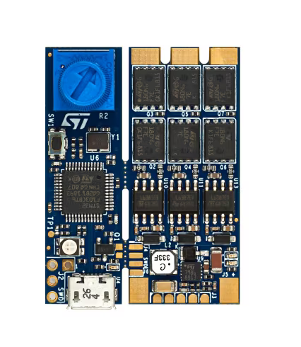
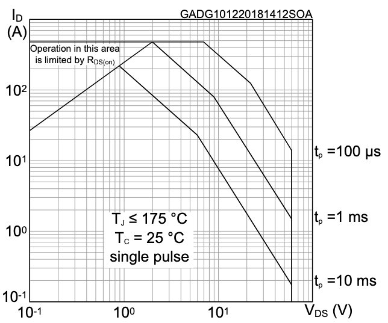
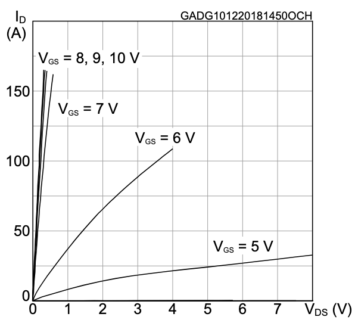

# FOC

## Info

The goal of this project is to implement and test sensorless field-oriented control (FOC) on a B-G431B-ESC1 microcontroller to control BLDC-motors.

## B-G431B-ESC1

### STM32G431CB

### L6387

### STL180N6F7

#### MOSFET Parameter
| Parameter       | Description          | Value       | Unit  |
|-----------------|----------------------|-------------|-------|
| V_DS            | Voltage drain-source | 60          | V     |
| V_GS            | Voltage gate-source  | ±20          | V     |
| R_DS_on         | Max drain-source resistance | 2.4     | mΩ    |
| I_DS            | Drain current        | 120         | A     |

#### Save operating space

#### Characteristics

## System design
